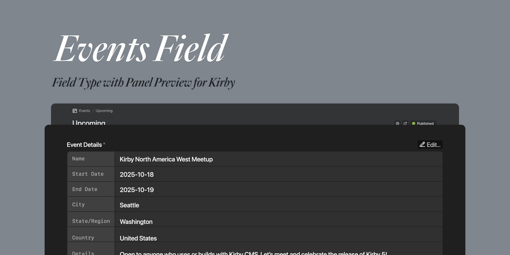

# Events Field plugin for Kirby



Adds a customizable Event Field Type for Kirby.

## Installation

### [Kirby CLI](https://github.com/getkirby/cli)
    
```bash
kirby plugin:install scottboms/kirby-events-field
```

### Git submodule

```bash
git submodule add https://github.com/scottboms/kirby-events-field.git site/plugins/kirby-events
```

### Copy and Paste

1. [Download](https://github.com/scottboms/kirby-events-field/archive/master.zip) the contents of this repository as Zip file.
2. Rename the extracted folder to `kirby-events` and copy it into the `site/plugins/` directory in your Kirby project.


## Usage

### Blueprint Configuration

In a Page blueprint, add a new field with the type `event.` Standard field attributes such as `label, required, help`, etc. can also be used to override defaults. Use `empty` to change the text displayed when the field is in an empty state.

#### Field Properties

| Name      | Type    | Default | Description                                                      |
|-----------|---------|---------|------------------------------------------------------------------|
| empty     | string  | `null`  | The placeholder text if no information has been added            |
| time      | boolean | `true`  | Include time as part of date fields                              |
| eventName | boolean | `true`  | If `true`, the field is available in the form                    |
| endDate   | boolean | `true`  | If `true`, the field is available in the form                    |
| venue     | boolean | `true`  | If `true`, the field is available in the form                    | 
| url       | boolean | `true`  | If `true`, the field is available in the form                    | 
| details   | boolean | `true`  | If `true`, the field is available in the form                    | 
| preview   | array   | `[ ]`   | Optional array of field names to display in the preview          | 


```yml
  event:
    # standard properties from Kirby
    label: Example Event
    required: false
    width: 1/3

    # field properties
    type: event
    empty: 'Add an event'

    # field attributes to include
    eventName: true
    endDate: false
    time: false
    venue: true
    url: true
    details: true

    # preview table display
    preview:
      - eventName
      - startDate
      - endDate
      - city
      - state
      - country
      - venue
      - url
      - details
```

### Templates and Snippets

To access an event field in your templates, you can use the toEvent() method.


```php
<?php if ($event = $page->event()->toEvent()): ?>
<h1><a href="<?= $event->url() ?>"><?= $event->eventName() ?></a></h1>

<div class="dates">
	<span class="start"><?= $event->startDate()->toDate('M d, Y') ?></span> –
	<span class="end"><?= $event->endDate()->toDate('M d, Y') ?></span>
</div>

<div class="location">
	<div class="venue"><?= $event->venue() ?></div>
	<span class="city"><?= $event->city() ?></span>, 
	<span class="state"><?= $event->state() ?></span> 
	<span class="country"><?= $event->country() ?></span>
</div>

<div class="details"><?= $event->details() ?></div>
<?php endif ?>
```


## Compatibility

* Kirby 4.x
* Kirby 5.x


## Disclaimer

This plugin is provided "as is" with no guarantee. Use it at your own risk and always test before using it in a production environment. If you identify an issue, typo, etc, please [create a new issue](/issues/new) so I can investigate.


## License

[MIT](https://opensource.org/licenses/MIT)
